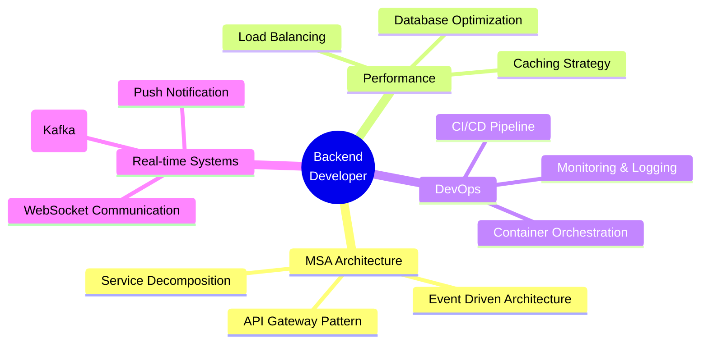

# 👋 안녕하세요! 백엔드 개발자 **김용준**입니다

<div align="center">


</div>

---

## 🎯 **ABOUT ME**

```typescript
const BackendDeveloper = {
    name: "김용준 (Kim Yong Jun)",
    location: "Seoul, South Korea 🇰🇷",
    role: "Backend Developer",
    experience: "1+ years",
    
    // 🔥 개발 철학
    philosophy: {
        fundamentals: "원초적인 개발을 이해하고 기초를 충실히 하는 개발자",
        performance: "매 프로젝트에서 성능 튜닝 실력을 향상시키는 것이 목표",
        codeQuality: "확장성과 유지보수성을 고려한 코드 작성",
        reusability: "Core 라이브러리 설계로 재사용 가능한 아키텍처 구축"
    },
    
    // ⚡ 핵심 강점
    strengths: [
        "빠른 학습력과 실무 적용 능력",
        "기술 트렌드에 대한 끊임없는 관심",
        "이해할 때까지 파고드는 집요한 탐구력",
        "성능 최적화에 대한 깊은 관심"
    ],
    
    currentFocus: "확장 가능한 MSA 시스템 & 성능 최적화",
    motto: "기초가 탄탄해야 높이 올라갈 수 있다"
};
```

<div align="center">

### 🌟 **"기초를 탄탄히, 성능을 극한까지, 코드로 가치를 창조합니다"**

</div>

---

## 🛠 **TECH STACK**

<div align="center">

### 🚀 **Backend & Core**


### 🗄 **Database**


### ☁️ **DevOps & Cloud**


### 🎨 **Frontend**


</div>

---

## 📊 **GITHUB STATS**

<div align="center">


</div>

<div align="center">

[](https://git.io/streak-stats)

</div>

---


## 💡 **CORE COMPETENCIES**

<div align="center">



</div>


### 💡 **개발 접근 방식**

```java
// 성능을 고려한 코드 작성 예시
@Component
public class PerformanceOptimizedService {
    
    // 🚀 캐시 전략으로 조회 성능 개선
    @Cacheable(value = "userCache", key = "#userId")
    public User findUser(Long userId) { ... }
  
    
    // 🎯 배치 처리로 DB 부하 최소화
    @BatchSize(50)
    public void bulkInsert(List<Entity> entities) { ... }
}
```

**🔧 Core 라이브러리 활용 철학:**
- 반복되는 로직은 공통 모듈화하여 재사용성 극대화
- Git Repository & Nexus를 통한 체계적인 의존성 관리
- 버전 관리와 하위 호환성을 고려한 API 설계


---

## 📝 **BLOG & SHARING**

<div align="center">

### ✍️ **기술 블로그**

[](https://velog.io/@agida0413/posts)

**📚 주요 포스팅 주제:**
- MSA 아키텍처 설계 경험
- Kafka를 활용한 이벤트 기반 시스템
- Redis 고급 활용법 (GEO, Sorted Set)
- Kubernetes 실무 적용기
- Spring Boot 성능 최적화

</div>

---

## 🎯 **CAREER GOAL**

<div align="center">

### 🚀 **"더 나은 개발자로 성장하며, 팀과 함께 가치를 창조하는 것"**

**💼 추구하는 가치:**
- 🌱 **지속적인 학습**: 새로운 기술 습득과 깊이 있는 이해
- 🤝 **협업과 소통**: 팀워크를 통한 시너지 창출
- 🎨 **클린 코드**: 가독성과 유지보수성을 고려한 코드 작성
- ⚡ **성능과 안정성**: 사용자 경험을 최우선으로 생각

</div>

---

<div align="center">

### 📞 **CONTACT & CONNECT**

[](mailto:yongjun413@daum.net)
[](https://github.com/agida0413)

---


</div>
